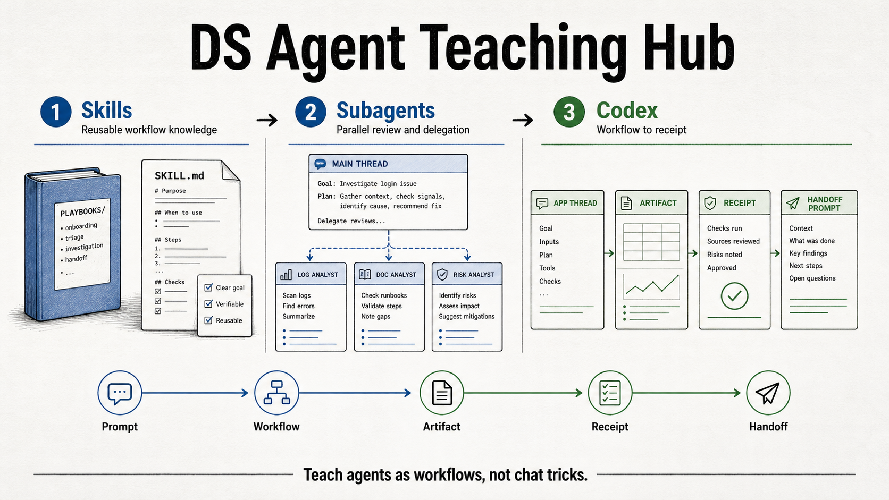

# DS Agent Teaching Materials

A practical curriculum for teaching data scientists how to use AI agents as repeatable workflows: skills, subagents, Codex, artifacts, receipts, and handoff.

## Sessions

| Track | Teaches | Best For | Entry Point |
| --- | --- | --- | --- |
| Skills for DS | Reusable workflow knowledge | Teams that keep re-explaining prompts, context, metric rules, and report formats | [sessions/skills-for-ds/README.md](sessions/skills-for-ds/README.md) |
| Codex onboarding | Workflow routing, Codex App/CLI, artifacts, receipts, and handoff | Live offsite sessions and async onboarding for Codex workflows | [sessions/codex-onboarding/README.md](sessions/codex-onboarding/README.md) |
| Subagents for DS | Parallel review, delegation, and multi-perspective analysis | Coming next, planned import from the subagent tutorial repo | Coming next |

## Recommended Paths

| Starting Point | Path |
| --- | --- |
| New to agent workflows | Skills for DS -> Subagents for DS -> Codex onboarding |
| Preparing the Codex offsite | Codex onboarding -> Skills for DS |
| Building repeatable DS workflows | Skills for DS -> Codex onboarding -> Subagents for DS |

## Standalone Projects

| Project | Purpose | Entry Point |
| --- | --- | --- |
| Codex tutorial | Self-contained Codex onboarding package with docs, assets, source notes, image prompts, and link-check scaffolding | [projects/codex_tutorial/README.md](projects/codex_tutorial/README.md) |

## Repository Map

- [sessions/](sessions/README.md) contains reader-facing teaching packages.
- [projects/](projects/README.md) contains self-contained packages that can be split into separate repositories later.
- [references/](references/README.md) contains source notes, research synthesis, and design references.
- [docs/](docs/design-spec.md) contains project-level design notes.
- [scripts/](scripts/) contains generation utilities used for earlier visual exploration.

## Live Site

The GitHub Pages entry is [index.html](index.html), a static landing page for this teaching hub.

The current slide deck still lives at:

[sessions/skills-for-ds/slides/skills-for-ds.html](sessions/skills-for-ds/slides/skills-for-ds.html)

## Codex Framing

> Start with a workflow. End with a receipt.

Use the Codex package to teach workflow routing across RovoDev CLI, Cursor App, Codex App, and Codex CLI; then show how Codex turns work into visible artifacts, verification receipts, and teammate-readable handoff.
