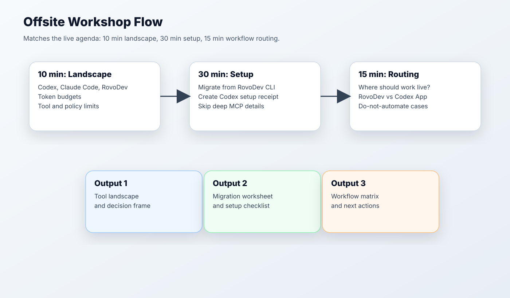
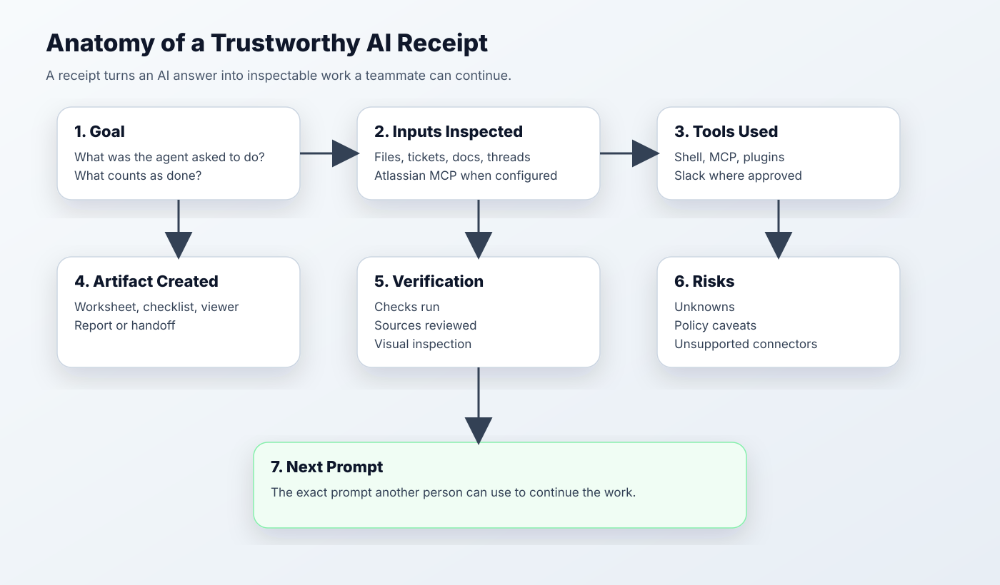
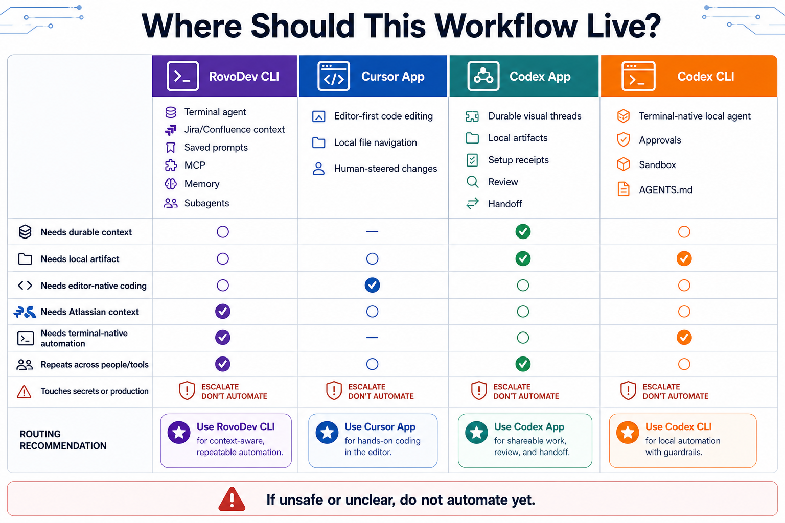
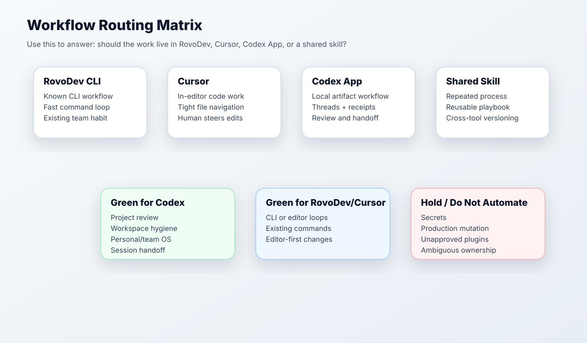

# Offsite Version: Codex Setup + Daily Workflow

Generated: 2026-06-02

This version is the live workshop script. It follows the agenda screenshot, but the narrative is intentionally simpler:

> Start with a workflow. End with a receipt.



## Opening Claim

Most people onboard to Codex by learning features. That is backwards.

The useful question is:

> Where should this workflow live, and what evidence should it leave behind?

Use this balanced position in the room:

- **RovoDev CLI is the most Atlassian-native default surface**: Jira, Confluence, Atlassian-grounded workflows, and existing internal CLI habits are closest to its center of gravity.
- **Codex CLI/App can also connect to Atlassian MCP**: when configured, Codex can read Jira, Confluence, and Bitbucket context, and can participate in PR workflows.
- **Codex CLI/App is strongest for the GPT-model-based agent harness and user-friendly workflow surface**, especially Codex App when you want visible threads, artifacts, teaching material, receipts, and handoff.
- **Connector availability is policy-shaped**: Slack can be connected where approved; some third-party connectors such as Gmail may be unavailable or incomplete in the current environment.
- **Cursor App is strongest when the work belongs inside the editor**: source edits, diffs, navigation, and human-steered coding loops.

## Act 1: 10 Minutes - Pick The Right Surface

Do not start by listing features. Start with a workflow someone already does.

Room prompt:

```text
Name one workflow you already do in RovoDev CLI, and one workflow that would benefit from a durable artifact, receipt, or handoff.
```

Show the before/after frame:


Teach the routing rule:

| If the workflow starts from... | Start Here | Why |
| --- | --- | --- |
| Jira, Confluence, existing Atlassian-native habit | RovoDev CLI by default | Closest to Atlassian workflow and internal CLI muscle memory |
| Jira, Confluence, Bitbucket, PR context plus GPT-model harness or artifacts | Codex App/CLI via Atlassian MCP when configured | Atlassian access is not RovoDev-only |
| Source editing inside the IDE | Cursor App | Editor-native diffs, navigation, and code loops |
| Terminal automation with explicit approvals | Codex CLI | GPT-model harness in shell with sandbox/approval posture |
| A messy workflow that needs a visible artifact and handoff | Codex App | User-friendly threads, worksheets, receipts, and visual outputs |

Reference matrix:

| Tool Surface | Best For | Watch Out For |
| --- | --- | --- |
| RovoDev CLI | Most Atlassian-native default workflow: Jira/Confluence-grounded work, saved prompts, memory, subagents, web/server mode | Do not present it as only a lightweight command loop; its strength is integrated Atlassian-aware CLI agent work |
| Cursor App | IDE/editor-first coding, chat over codebase, agent/manual modes, rules, MCP, fast file navigation and code edits | Less natural for off-repo operating-system style handoffs unless you create files deliberately |
| Codex App | Most user-friendly Codex surface: GPT-model agent harness, durable threads, local artifacts, visual outputs, Atlassian MCP where configured, teaching-friendly receipts | Tool/plugin/connector availability varies by workspace policy; Slack may be available while Gmail or other third-party connectors may not be |
| Codex CLI | Terminal-first Codex harness: GPT-model local agent, sandbox/approval controls, AGENTS.md instructions, MCP/config, Atlassian MCP where configured, automation-friendly execution | Less visual than the App; best when the workflow belongs in shell or CI-like loops |
| Claude Code | Strong peer/review/planning complement | Different workflow assumptions and setup |

Checkpoint:

```text
Each participant should be able to classify one workflow into RovoDev CLI, Cursor App, Codex App, or Codex CLI.
```

## Act 2: 30 Minutes - Migrate One Real Workflow

The live demo should migrate a workflow, not teach a feature list.

Recommended demo workflow:

```text
Weekly project review / experiment review / notebook cleanup.
```

Why this demo works:

- it is familiar;
- it has messy context;
- it benefits from a worksheet;
- it needs evidence and risks;
- it can become a skill candidate later.

Use this migration worksheet live:

| Current RovoDev CLI habit | Codex equivalent | What transfers | What changes | Verification artifact |
| --- | --- | --- | --- | --- |
| Plan or review work in terminal | Codex App thread or Codex CLI | Prompt shape, project rules, review checklist | App adds visual artifacts; CLI keeps terminal speed | Review receipt |
| Saved prompt or repeated checklist | Shared skill / reusable prompt | Workflow sequence, examples, output contract | Adapter syntax differs by tool | Markdown checklist |
| Jira/Confluence/Bitbucket-grounded task | RovoDev CLI by default, or Codex App/CLI via Atlassian MCP when configured | Source context, ticket framing, PR context | Native default vs MCP setup differs; connector availability and auth model differ | Source links + decision receipt |
| Worktree/subagent coding task | RovoDev CLI, Codex CLI, or Codex App depending on audience | Planning, branch discipline, verification loop | UI, approval model, and artifact style differ | Branch/test receipt |
| Notebook or project cleanup | Codex App project thread, Codex CLI, or Cursor | Local context, cleanup plan, checks | Editor-native edits may be faster in Cursor | Cleanup plan + checks |

Live prompt:

```text
We are migrating one current workflow into the right AI surface.

Create a markdown worksheet with:
- current workflow;
- best starting surface: RovoDev CLI, Cursor App, Codex App, or Codex CLI;
- what transfers directly;
- what changes;
- required setup;
- policy/tool caveats;
- expected artifact;
- verification receipt.

Important:
- RovoDev CLI is the Atlassian-native default.
- Codex App/CLI can also use Atlassian MCP for Jira, Confluence, Bitbucket, and PR context when configured.
- Slack may be available where approved.
- Gmail and some third-party connectors may be limited or unavailable.
- Do not assume computer use or disabled plugins are available.
```

## Act 3: Produce The Artifact

The demo is not done when Codex gives a good answer. It is done when Codex leaves an artifact that another person can inspect.

Expected artifact:

```text
workflow-migration-worksheet.md
workflow-receipt.md
next-session-prompt.md
```

Receipt anatomy:



Ask the room to inspect:

- Did Codex cite what it actually read?
- Did it separate known facts from assumptions?
- Did it name tool or connector caveats?
- Did it leave a next prompt?
- Could a teammate continue from this artifact without replaying the whole conversation?

## Act 4: 15 Minutes - Daily Workflow Recommendations





Use this final rule:

- Use **RovoDev CLI** when you want the Atlassian-native default for Jira/Confluence/internal workflow context.
- Use **Cursor App** when the work is primarily editor-native coding, file navigation, code review, and quick iterative edits.
- Use **Codex App** when you want the most user-friendly Codex experience: GPT-model agent harness, durable visual threads, artifacts, teaching material, receipts, cross-session handoff, and Atlassian MCP access when configured.
- Use **Codex CLI** when you want the GPT-model Codex harness in the terminal, with explicit sandbox/approval controls, AGENTS.md rules, scripted local repetition, and Atlassian MCP access when configured.
- Use **shared skills** when the workflow repeats across tools and people.
- Use **do not automate yet** when the task touches secrets, production mutation, unclear ownership, or unapproved tools.

## Daily Workflow Examples

| Daily Workflow | Suggested Surface | Codex Prompt Shape |
| --- | --- | --- |
| Morning research/readout | Codex App recurring thread | "Summarize new evidence, rank uncertainty, save receipt" |
| Experiment review | Codex App | "Find leakage risks, metric issues, and decision criteria" |
| Notebook hygiene | Codex App or Cursor | "Plan cleanup first; preserve behavior; verify" |
| PR/code review | Codex App + existing review tools | "Find correctness risks first, then summarize" |
| Meeting handoff | Codex App | "Create next-session prompt and state file" |

## Bridge To Session Two

If three people repeat the same Codex prompt next week, that is no longer just a prompt.

It is a skill candidate.

Session two should cover how to manage those skills across RovoDev, Cursor, Codex, and Claude Code without version drift.

## Screenshot Goal

End with one screen showing:

1. the tool landscape;
2. the migrated Codex setup;
3. a workflow routing matrix;
4. a visible verification receipt.

## Tool Showcase Track

Use tools as memorable examples, not as the whole workshop.


| Tool / Pattern | Status For Offsite | Why It Helps People Understand Codex |
| --- | --- | --- |
| HyperFrames | Confirmed showcase | Shows Codex can create polished motion/video artifacts from HTML, not just text |
| Markdown -> HTML artifact | Confirmed showcase | Converts agent work into a readable deliverable |
| Atlassian MCP | Confirmed setup path where configured | Lets Codex App/CLI read Jira, Confluence, Bitbucket, and PR context instead of treating Atlassian context as RovoDev-only |
| Slack connector/MCP | Available where approved | Useful for workflow handoff and team context |
| Gmail / some third-party connectors | Limited or unavailable depending on policy | Do not build the live demo around unsupported connectors |
| Chrome DevTools CLI | Pending verification | Potential frontend debugging demo; do not promise until verified |

Suggested HyperFrames demo framing:

```text
Use HyperFrames to create a 20-30 second animated explainer for the Codex onboarding flow: landscape -> setup -> workflow routing. Keep it simple, renderable, and evidence-backed.
```
