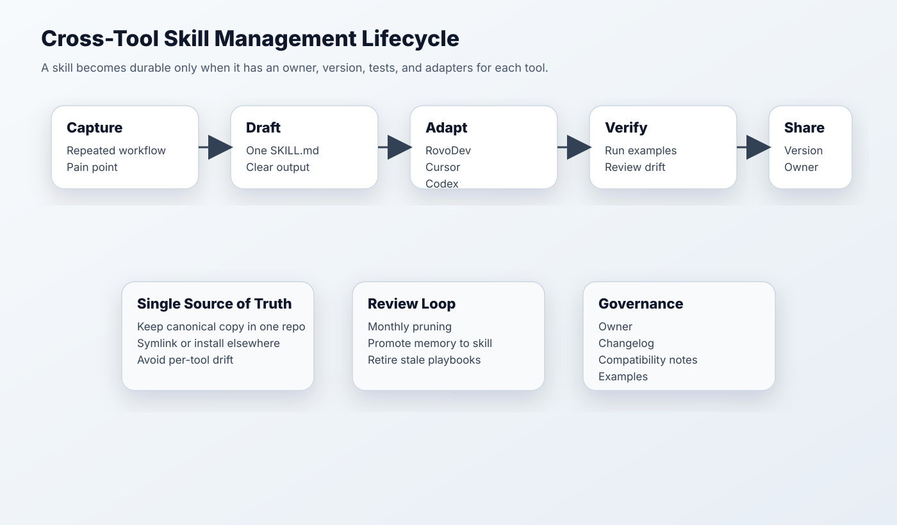

# Skill Management Across RovoDev, Cursor, and Codex

Generated: 2026-06-02



## Why This Needs Its Own Session

The bookmark theme here is sharp: the hard part is no longer writing one skill. The hard part is preventing drift when the same workflow exists in Codex, Claude Code, Cursor, RovoDev, local copies, and team copies.

Use this doc for the second session where people share skills.

## Recommended Operating Model

| Layer | Recommendation | Why |
| --- | --- | --- |
| Source of truth | Keep canonical skills in one repo/folder | Prevents Codex copy, Cursor copy, RovoDev copy drift |
| Distribution | Install or symlink into each tool | Keeps tools compatible without rewriting |
| Metadata | Owner, version, compatible surfaces, examples | Makes skills reviewable |
| Testing | Keep 1-3 example prompts and expected outputs | Catches stale instructions |
| Review cadence | Monthly or after repeated failures | Skills decay as workflows change |

## Suggested Folder Shape

```text
agent-workflows/
  skills/
    experiment-review/
      SKILL.md
      examples/
        prompt.md
        expected-output.md
      CHANGELOG.md
      compatibility.md
    notebook-cleanup/
      SKILL.md
      examples/
  adapters/
    codex.md
    cursor.md
    rovodev.md
```

## What Goes In A Good Skill

- outcome;
- when to use it;
- when not to use it;
- required inputs;
- step-by-step workflow;
- safety boundaries;
- output format;
- verification;
- examples;
- owner and version.

## Cross-Tool Adapter Notes

| Tool | Skill Handling Pattern | Notes |
| --- | --- | --- |
| Codex | Skill file + project instructions + local artifacts | Strong for receipts, handoffs, and durable threads |
| Cursor App | Keep skill as project rules, reusable prompts, or editor workflow notes | Strong for in-editor execution |
| RovoDev CLI | Map canonical skills to saved prompts, memory, MCP-aware flows, and CLI/web session habits | Strong when Atlassian-grounded terminal workflows already exist |
| Codex CLI | Map canonical skills to AGENTS.md, config, MCP, and repeatable terminal prompts | Strong for scripted or shell-native workflows |
| Claude Code | Similar skill pattern, useful for planner/reviewer roles | Watch for different workflow assumptions |

## Skill Lifecycle

1. Capture repeated workflow.
2. Draft one canonical `SKILL.md`.
3. Add examples and expected outputs.
4. Add adapters for Codex, Cursor, and RovoDev.
5. Use in real work.
6. Promote improvements from receipts/memories.
7. Retire stale versions.

## Second-Session Demo Ideas

- Handoff/session context management skill.
- Experiment review skill.
- Notebook cleanup skill.
- Skill improvement skill: "review recent receipts and propose skill edits."

## Bookmark Anchors

- AdrianPunk115: version drift across Codex, Claude Code, local, and team copies.
- Michaelzsguo: skills should be versioned, organized, portable, and reproducible.
- Saccc_c / kr0der / vista8: memories and repeated workflows can become skill candidates.
- SkillOpt posts: skills can be iterated and evaluated, not just hand-written once.
