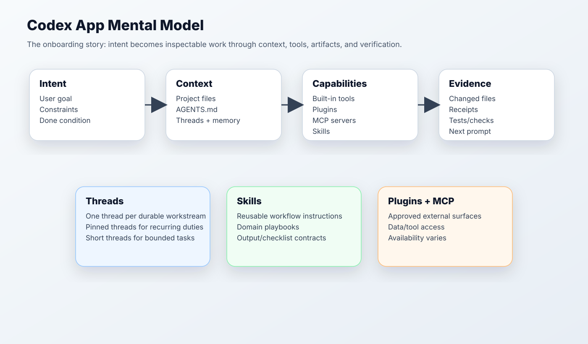
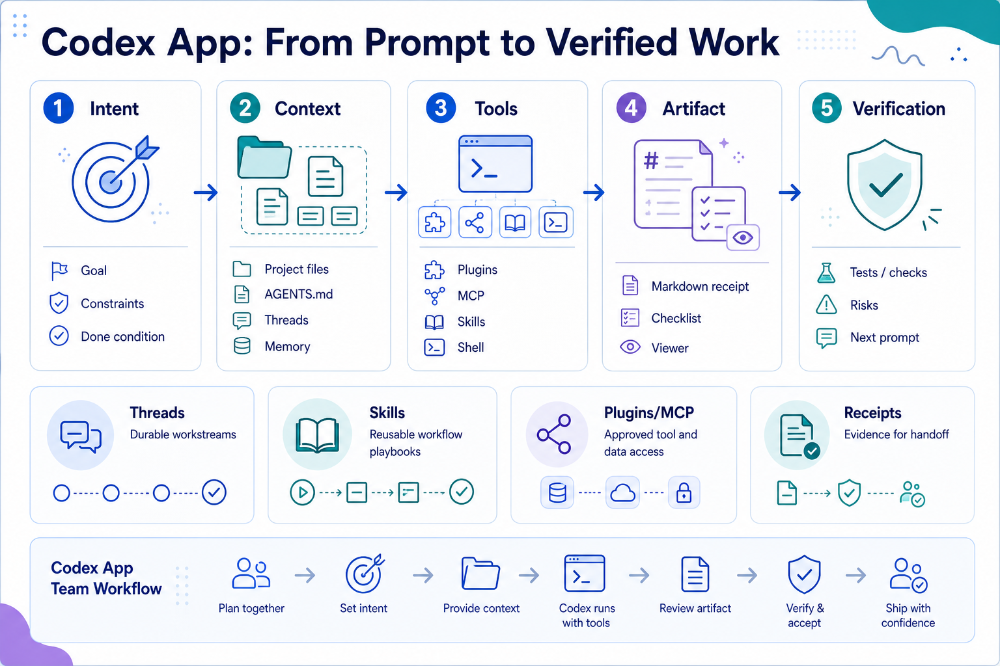
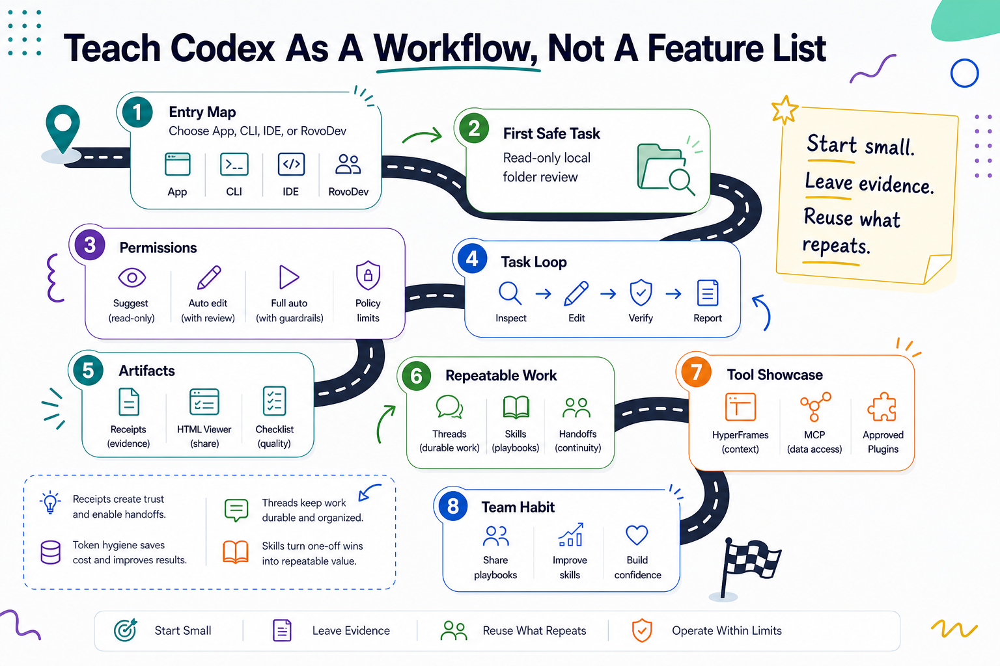
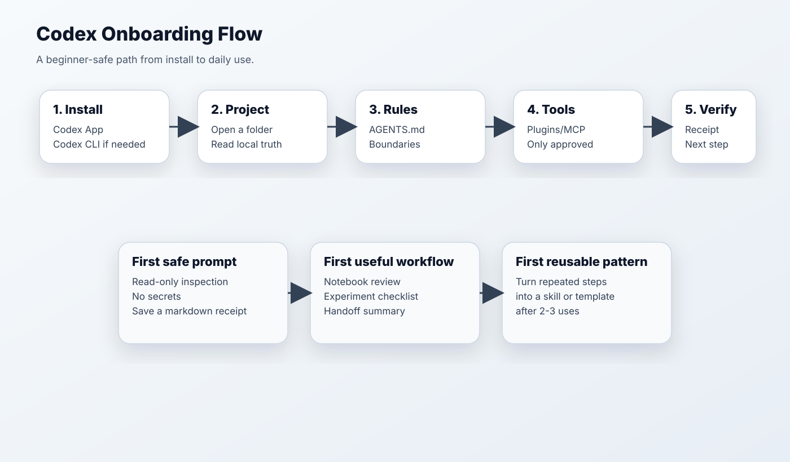

# Codex 101: General Onboarding

Generated: 2026-06-02





## What Codex Is For

Most failed Codex onboarding starts by teaching features. Better onboarding starts with a repeated workflow.

Codex is a local, agentic work surface, but the useful mental shift is simpler:

> Start with a workflow. End with a receipt.

Do not treat Codex as just a smarter chat box. Treat it as a workspace agent that can read local files, follow project instructions, use approved tools, create artifacts, and leave evidence.

Codex is strongest when the workflow needs one or more of these:

- local project context;
- repeatable instructions;
- inspectable artifacts such as markdown receipts, checklists, or small viewers;
- verification before handoff;
- durable threads for recurring work.

## The Core Objects

Introduce these objects only after the workflow is clear:

| Concept | Plain-English Meaning | Good First Example |
| --- | --- | --- |
| Codex App | Desktop workspace for agent sessions | Open a project folder and ask for read-only analysis |
| Thread | A durable conversation/workstream | One thread for a project, one for a recurring weekly pulse |
| Project instructions / AGENTS.md | Local rules Codex should follow | Safety boundaries, output format, test expectations |
| Skill | Reusable workflow instruction | "Review an experiment plan and produce a risk checklist" |
| Plugin | Bundled capability exposed inside Codex | Browser, Google Drive, GitHub, or other enabled integrations |
| MCP server | Tool/data bridge | Approved access to internal or external systems |
| Artifact | A file Codex creates or updates | Markdown receipt, migration worksheet, HTML viewer |
| Verification receipt | Evidence that work was checked | Files read, commands run, risks, next step |

## Beginner-Safe Onboarding Flow





### Step 1: Start With A Folder

Open a small project folder or a scratch workshop folder. New users learn faster when Codex has a real local surface to inspect.

### Step 2: Give The Work A Boundary

Use a prompt like:

```text
Do a read-only review of this folder. Identify what this project is for, what files matter, what is safe to change later, and what should not be touched. Save a short markdown receipt. Do not edit files.
```

### Step 3: Add Project Rules

Create or point to local instructions that say what matters:

- what the repo/project is;
- what files are protected;
- what output format you want;
- what verification means;
- when Codex should stop.

### Step 4: Introduce Tools Carefully

Plugins and MCP are capability multipliers, not the first lesson. Say explicitly that tool availability varies by workspace policy and setup. The core workflow still works with local files, markdown, shell commands, and verification.

### Step 5: Teach Receipts Early

Every useful Codex workflow should leave a small trace:

- goal;
- files inspected;
- artifacts created;
- checks run;
- risks or unknowns;
- next prompt.

## First Three Exercises

1. Read-only folder orientation.
2. Turn a messy project note into an experiment or decision checklist.
3. Create a handoff receipt for a teammate.

## Source Threads From X Bookmarks

This doc draws from saved posts about Codex App setup/reliability, AGENTS.md operating philosophy, token-budget hygiene, Codex App threads, /goal usage, plugins/MCP, and artifact-based workflows. See `../codex-101-x-bookmark-classification.md` for the full bookmark appendix.

## Tutorial Pattern Borrowed From CodexGuide

CodexGuide is useful less because of any single fact and more because of its teaching shape:

1. build an entry map first;
2. run one complete low-risk task;
3. teach permissions before power features;
4. explain task execution and parallel threads;
5. then move to skills, plugins, MCP, and team practice.

Use the same progression here, but fill it with the offsite's real RovoDev migration and workflow-routing examples.
