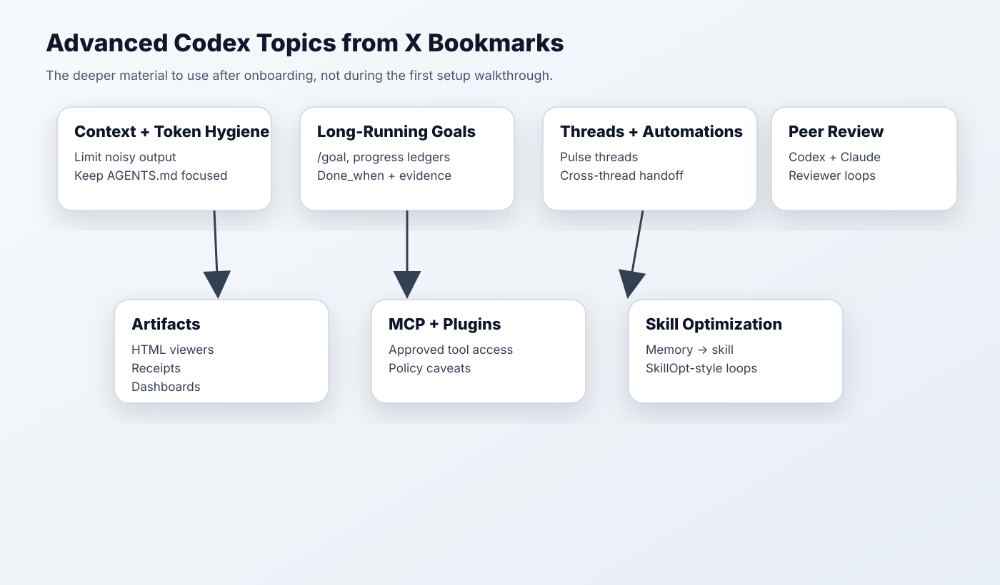

# Advanced Codex Topics From X Bookmarks

Generated: 2026-06-02

This is the appendix for people who already understand Codex basics. Do not lead the offsite with this. Use it as follow-up reading or a second/third session outline.



## Claims Worth Teaching

These are the X-post-style claims worth turning into teaching moments:

1. **Workflow first**
   The mistake is not that people fail to learn every Codex feature. The mistake is that they do not know which workflow should live where.

2. **Token hygiene**
   The problem is not just that models read too much. The common failure is noisy command output polluting context before the agent has found the useful evidence.

3. **Artifacts create trust**
   AI output becomes useful when it becomes inspectable: worksheets, HTML viewers, checklists, receipts, dashboards, and handoff prompts.

4. **Threads are work surfaces**
   Durable threads turn Codex from a chat box into a recurring work surface.

5. **Skills stop workflow drift**
   The hard part is not writing a skill once. The hard part is preventing useful workflows from drifting across people, tools, and local copies.

6. **Atlassian context is not RovoDev-only**
   RovoDev CLI is the Atlassian-native default, but Codex App/CLI can use Atlassian MCP for Jira, Confluence, Bitbucket, and PR context when configured.

7. **Receipts are the safety layer**
   A receipt is the difference between a nice answer and work another person can inspect, verify, and continue.

## 1. Token Budget And Context Hygiene

Several saved posts point to the same practical issue: agents waste budget when they ingest noisy command output or oversized context. Teach users to ask for bounded output, targeted file reads, and receipts instead of dumping everything into context.

Prompt pattern:

```text
Before running any broad command, state the smallest query that can answer the question. Limit output. Summarize only evidence relevant to the goal.
```

## 2. Long-Running Goals And Progress Ledgers

The /goal-related bookmarks are useful for long-horizon work, but the lesson is broader: define done_when, keep a progress ledger, and require evidence before declaring success.

Use for:

- migrations;
- cleanup projects;
- multi-step analysis;
- benchmark/eval work.

## 3. Threads, Pulse Threads, And Cross-Thread Handoffs

Bookmarks about persistent threads and cross-thread collaboration suggest a powerful pattern: keep durable threads for recurring duties, and create handoff files when work crosses context boundaries.

Example threads:

- personal/team OS thread;
- weekly experiment review thread;
- project handoff thread;
- morning research pulse thread.

## 4. Artifacts As Agent UI

Saved posts about HTML artifacts, viewers, dashboards, and receipts point to a core teaching idea: for long work, the output should often be an artifact, not just a chat response.

Good artifacts:

- markdown receipts;
- HTML data-quality viewers;
- experiment-risk boards;
- migration worksheets;
- workflow routing matrices.

## 5. Multi-Agent And Peer Review

The bookmarks include Codex + Claude Code peer-review patterns, subagent patterns, and long-running agent workshops. The onboarding-safe version is simple: separate authoring from review.

Prompt pattern:

```text
First produce the plan or artifact. Then review it skeptically: correctness, missing evidence, unclear assumptions, and verification gaps.
```

## 6. MCP, Plugins, Browser, And Policy Boundaries

MCP and plugins are powerful but should be taught as approved capability surfaces, not magic. In policy-constrained sessions, emphasize that disabled computer use or plugins do not block the core Codex workflow.

Green examples:

- local file review;
- markdown artifacts;
- approved MCP data lookup;
- GitHub review where enabled.

Red examples:

- secrets;
- private browser automation when disabled;
- production mutation;
- unapproved data export.

## 7. Skill Optimization And Self-Improving Workflows

The skill-management bookmarks point to a future direction: skills can be improved using examples, failures, receipts, and memory-derived patterns. This is useful after the team has a canonical skill source of truth.

Workflow:

1. Collect receipts from real use.
2. Identify repeated corrections.
3. Propose skill edits.
4. Test against examples.
5. Version and distribute.

## 8. Personal Or Team Operating Surface

Several posts describe Codex as a persistent personal operating surface: pulse threads, logs, recurring workstreams, and project connections. This maps naturally to:

- experiment memory;
- weekly research agenda;
- stakeholder handoffs;
- recurring metric checks;
- project next-action tracking.

## Recommended Advanced Session Structure

| Session | Topic | Demo |
| --- | --- | --- |
| Advanced 1 | Long-running goals + receipts | Cleanup or migration ledger |
| Advanced 2 | Skills and governance | Promote a repeated workflow into a skill |
| Advanced 3 | Artifacts and dashboards | Build a small HTML viewer for evidence |
| Advanced 4 | Peer review and multi-agent | Separate author/reviewer loops |

## 9. Tool Showcase Ideas

Use X insights as the menu:


- HyperFrames + Codex for short explainer videos and motion graphics.
- HTML artifacts for evidence viewers and readable long-horizon agent summaries.
- Research cockpit patterns with search, clustering, reflection, and next-query suggestions.
- Browser/Chrome workflows where workspace policy allows them.
- Chrome DevTools CLI as a pending candidate, not a guaranteed offsite demo until verified.
