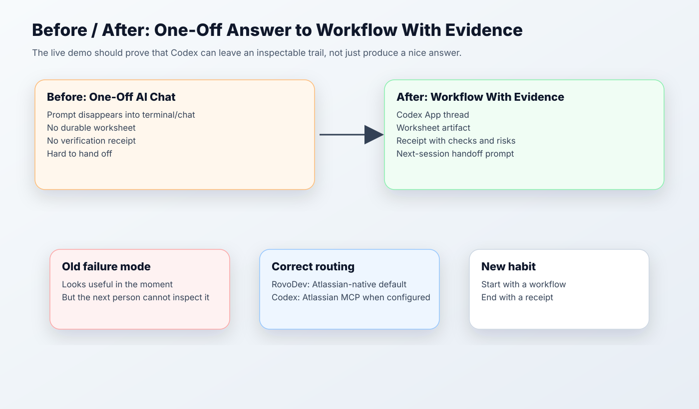

# Facilitator Runbook: Start With A Workflow, End With A Receipt

Generated: 2026-06-02

## Purpose

Help participants decide where a workflow should live, then show Codex App creating an inspectable artifact and receipt.

## Facilitation Thesis

Most people onboard to Codex by learning features.

That is backwards.

Start with a workflow. End with a receipt.

## Room Setup

- Session length: 55 minutes.
- Audience: people familiar with RovoDev CLI or similar AI coding tools.
- Required surfaces to discuss: RovoDev CLI, Cursor App, Codex App, Codex CLI.
- Confirmed framing: RovoDev is the Atlassian-native default, but Codex App/CLI can also use Atlassian MCP when configured.
- Connector caveat: Slack may be available where approved; Gmail and some third-party connectors may be limited or unavailable.

## Segment 1: Routing Pain, Not Tool Taxonomy

Timebox: 10 minutes.

Say:

```text
We are not here to memorize Codex features.
We are here to decide where a workflow should live and what evidence it should leave behind.
```

Ask:

```text
Name one workflow you already do in RovoDev CLI, and one workflow that needs a durable artifact or handoff.
```

Show:



Checkpoint:

Participants can classify one workflow into RovoDev CLI, Cursor App, Codex App, or Codex CLI.

## Segment 2: Live Workflow Migration

Timebox: 25-30 minutes.

Use [Live Demo: Workflow Migration Receipt](03-live-demo-workflow-receipt.md).

Run the prompt.

Do not narrate every Codex feature while it works. Narrate the artifact trail:

1. What context did it use?
2. What artifact is it creating?
3. What verification will make it trustworthy?
4. What handoff will let another person continue?

## Segment 3: Receipt Inspection

Timebox: 10 minutes.

Show:


Ask the room:

- What evidence did Codex inspect?
- What assumptions remain?
- What connector caveats matter?
- What would you reject before trusting this?
- Is the next prompt usable?

## Segment 4: Make The Habit Repeatable

Timebox: 5-10 minutes.

Say:

```text
If three people repeat the same Codex prompt next week, that is no longer a prompt.
It is a skill candidate.
```

Bridge:

- Session one: workflow -> artifact -> receipt.
- Session two: repeated workflow -> shared skill -> drift management.

## Closing Exercise

Ask each participant to write:

1. one workflow to try tomorrow;
2. the best starting surface;
3. the artifact they expect;
4. the receipt fields they need before trusting it.

## Failure Modes To Avoid

- Do not imply Atlassian context is RovoDev-only.
- Do not make the live demo depend on Gmail or unsupported third-party connectors.
- Do not show only abstract infographics.
- Do not end with a chat answer; end with a file artifact and receipt.
- Do not merge skill governance into the first session; bridge to it.
