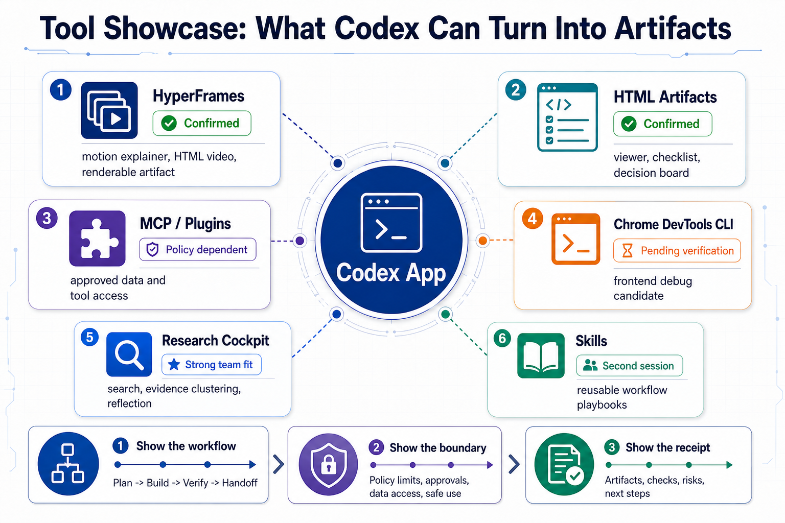

# Codex Onboarding Package

Generated: 2026-06-02

This folder contains the teaching materials distilled from the X bookmark research and the live offsite agenda screenshot.

## Use These For The Offsite

1. [Codex 101 general](01-codex-101-general.md) - conceptual onboarding for Codex App, threads, plugins, MCP, skills, and artifacts.
2. [Live workshop script](02-live-workshop-script.md) - live-session script aligned to the 10/30/15 agenda.
3. [Live demo workflow receipt](03-live-demo-workflow-receipt.md) - the concrete live exercise: worksheet, receipt, and next-session prompt.
4. [Facilitator runbook](04-facilitator-runbook.md) - a timeboxed script for running the workshop.
5. [Tool surface comparison](05-tool-surface-comparison.md) - source-backed correction for Rovo Dev CLI, Cursor App, Codex App, and Codex CLI.
6. [Skill management across tools](06-skill-management-across-tools.md) - second-session material for skill sharing and governance.
7. [Advanced topics from X bookmarks](07-advanced-topics-from-x-bookmarks.md) - follow-up reading after the first onboarding session.
8. [Markdown image insertion pattern](08-markdown-image-insertion-pattern.md) - how to place screenshots and generated visuals inside tutorial markdown.

## Visual Assets

- [Image-gen-2 Codex mental model](assets/imagegen-codex-mental-model.png)
- [Image-gen-2 workflow routing matrix](assets/imagegen-workflow-routing.png)
- [Image-gen-2 tutorial ladder](assets/imagegen-tutorial-ladder.png)
- [Image-gen-2 tool showcase map](assets/imagegen-tool-showcase.png)
- [Codex App mental model](assets/codex-app-mental-model.svg) / [PNG](assets/codex-app-mental-model.png)
- [Codex onboarding flow](assets/codex-onboarding-flow.svg) / [PNG](assets/codex-onboarding-flow.png)
- [Offsite workshop flow](assets/offsite-workshop-flow.svg) / [PNG](assets/offsite-workshop-flow.png)
- [Workflow routing matrix](assets/workflow-routing-matrix.svg) / [PNG](assets/workflow-routing-matrix.png)
- [Skill management lifecycle](assets/skill-management-lifecycle.svg) / [PNG](assets/skill-management-lifecycle.png)
- [Advanced topics map](assets/advanced-topics-map.svg) / [PNG](assets/advanced-topics-map.png)
- [Before/after workflow](assets/before-after-workflow.svg) / [PNG](assets/before-after-workflow.png)
- [Receipt anatomy](assets/receipt-anatomy.svg) / [PNG](assets/receipt-anatomy.png)

## Image-gen-2 Infographic Prompts

These prompts follow the baoyu-infographic structure: layout + style + concise labels + clear visual hierarchy. Use them with Codex image generation when you want more polished slide-style illustrations.

- [Codex App mental model prompt](imagegen-prompts/01-codex-app-mental-model-infographic.md)
- [Workflow routing prompt](imagegen-prompts/02-workflow-routing-infographic.md)
- [Skill lifecycle prompt](imagegen-prompts/03-skill-lifecycle-infographic.md)
- [Tutorial ladder prompt](imagegen-prompts/04-codex-tutorial-ladder-infographic.md)
- [Tool showcase prompt](imagegen-prompts/05-tool-showcase-infographic.md)
- [Before/after workflow prompt](imagegen-prompts/06-before-after-workflow-infographic.md)
- [Receipt anatomy prompt](imagegen-prompts/07-receipt-anatomy-infographic.md)

## Markdown Image Pattern

The tutorial docs follow CodexGuide's recipe style: put images in a nearby asset folder, reference them with relative Markdown paths, and place each image immediately after the step it illustrates.

```md


```

See [Markdown image insertion pattern](08-markdown-image-insertion-pattern.md) for the reusable guide.

## Suggested Reading Order

For live facilitation: read docs 2 -> 3 -> 4.

For async onboarding: send docs 1 -> 2, then offer docs 5, 6, and 7 as follow-up.

## How The References Were Applied

- CodexGuide informed the teaching ladder: entry map, installation/setup, first safe task, task execution, permissions, then skills/plugins.
- CodexGuide's Chrome/browser plugin recipe informed the Markdown image placement style: relative paths, images near the relevant step, and short surrounding explanation.
- X bookmark themes supplied the real workflow content: receipts, durable threads, token hygiene, artifacts, long-running goals, and cross-tool skill drift.
- baoyu-infographic informed the visual prompt style: each generated image has a saved prompt with layout, style, aspect ratio, language, content blocks, and concise labels.
- HyperFrames is treated as the confirmed live showcase. Chrome DevTools CLI is deliberately labeled pending verification.

## Source Notes

Internal critique and rewrite-planning notes are kept out of the main reading path:

- [DS audience review and X-style gap analysis](../../references/codex/source-notes/ds-audience-review-x-style-gap.md)
- [Improvement plan for X-style rewrite](../../references/codex/source-notes/improvement-plan-x-style-rewrite.md)

## Source References Used

- X bookmark and skill-management synthesis is preserved in [../../references/codex/source-notes/](../../references/codex/source-notes/).
- baoyu-infographic skill: https://github.com/JimLiu/baoyu-skills/tree/main/skills/baoyu-infographic
- CodexGuide docs: https://github.com/freestylefly/CodexGuide/tree/main/docs
- CodexGuide Chrome/browser plugin recipe: https://github.com/freestylefly/CodexGuide/blob/main/docs/recipes/chrome-browser-plugin.md
